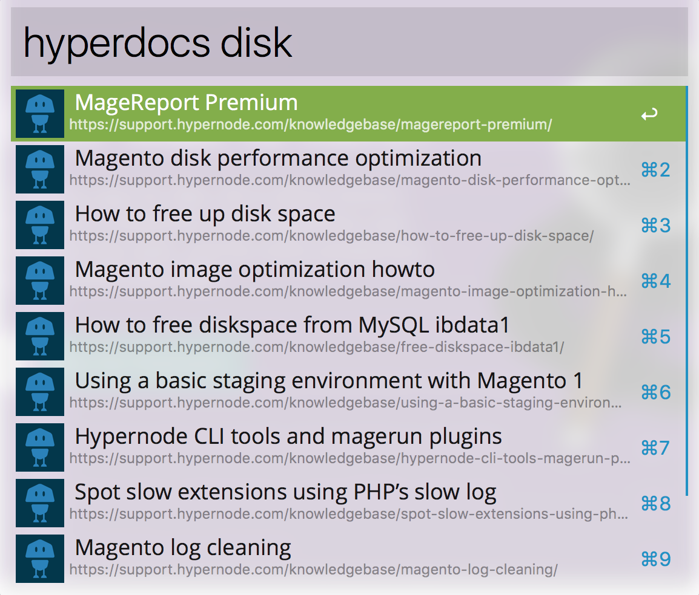

Alfred 3 Hypernode knowledgebase workflow
===========================
> A simple Alfred 3 workflow to query the hypernode knowledgebase.

This workflow basically provides a "quick" way to query the fantasic [Hypernode knowledgebase](http://support.hypernode.com/) and navigate to a topic. 

Refer to the [Alfred website](https://www.alfredapp.com/) 

# Installation

Install the `Hyperdocs.alfredworkflow` in Alfred.

Refer to the Alfred docs for more info.

Alfred 2 is untested.

# Usage

start with the __hyperdocs__ keyword, than add your keywork, be patient.

`hyperdocs disk`

